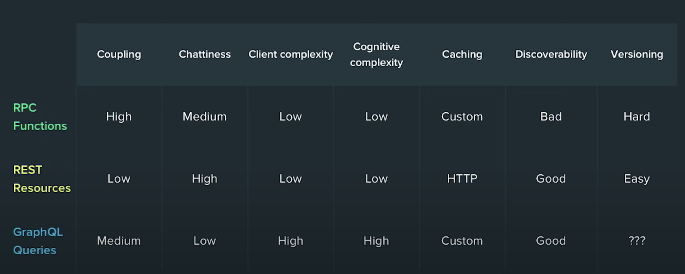

# API Design Considerations

## Summary
When deciding an architecture style to build your APIs with, start with the question, `who will be the client (consumer) of your APIs?`. Picking the "right" architecture style is about moving forward with the tradeoffs that work best for your use-case and your organization. There is no silver-bullet or perfect approach. 

Sections below provide food for thought.

## API Architecture Style Considerations

<details>
<summary>click to expand</summary>

For each architecture style shown in the table below, determine which tradeoffs works best for your use-cases.



> diagram source: https://youtu.be/IvsANO0qZEg?t=2025

</details>

## [Style]: Remote Procedure Call (RPC) 

<details>
<summary>click to expand</summary>

1. RPC style helps build Command or Action oriented APIs (functions), which are callable remotely.
1. This style works well for implementing pre-determined use-cases.
1. RPC follows contract-first approach: functions and messages are strongly typed and the contract is shared among client/server.

> gRPC is modern open source high performance Remote Procedure Call (RPC) framework. To learn more about gRPC and how to use it on .NET, [click here](https://github.com/shahzadhuq/modernization-gRPC-on-dotnet).

### **Net Gains**

1. RPC APIs are simple and easy to understand.
1. Strongly typed messages leads to lightweight payloads exchange.
1. High performance over network: helps achieve low latency for service-2-service communication.

### **Mindfulness**

1. Predefined action oriented nature leads to tight coupling with the system resources; slight variation to existing use-case will likely require new function implementation.
1. You could end up with "function explosion": create new set of functions to accomplish slightly different actions.
1. Lack of RPC API introspection could lead to poor discoverability: clients must know specific endpoint to call and downstream side-effects aren't always clear.

</details>

## [Style]: Representational State Transfer (REST)

<details>
<summary>click to expand</summary>

1. REST architecture style helps build resource management oriented APIs.
1. Unlike RPC, REST models resources (e.g. Person, Account), resource actions (e.g. CRUD operations), and relationship (i.e. links) between these resources.
1. APIs that follow REST style are considered RESTFul.

### **Net Gains**

1. REST style leads to decoupling client/server which helps both evolve independently.
1. For new use-cases, clients could potentially orchestrate existing resource management APIs differently to fulfil their requirements.
1. RESTFul APIs are self-describing: provides metadata to help clients understand how to interact with the RESTFul APIs.

### **Mindfulness**

1. RESTFul APIs can be chatty: clients may need to fetch data from multiple APIs for their unique use-cases. 
1. Relative to RPC style message, RESTFul payloads are bigger (loaded with helpful metadata).
1. Clients may end up getting more info (resource's attributes/data) than they need.

</details>

## Example - RPC and REST

<details>
<summary>click to expand</summary>

### **Base Use Case**

Assume you're building a chat system with well defined use-cases:

1. Client can acquire single/collection of conversations.
1. For given conversation, client can list its messages.
1. In a given conversation, client can send (reply) new messages.

Post go live, you get a New business use-case:

1. Client wants the ability to fetch message's author information.
#### **RPC Style Implementation**

<details>
<summary>click to expand</summary>

1. Given function oriented API style, RCP implementation below supports the well-defined use-cases.

    ```csharp
    // RPC API Service contract
    listConversations();
    listMessages(int converationId);
    sendMessages(int converationId, string body);

    // Client interacting with RPC API
    GET /listConversations
    GET /listMessages?id=123
    POST /sendMessages?id=123 { "body": "my new message" }    
    ```

1. To accommodate the new use-case, a New RPC function is added.

    ```csharp
    // Service contract exposed via HTTP APIs
    getAuthorInfo(int messageId)

    // RPC API interaction
    GET /getAuthorInfo(int messageId)
    ```

1. Over the lifespan of the product, you could have function explosion to support slight variation in use-cases.

    ```csharp
    // RCP functions
    listConversations
    listConversationsV2
    listMessages
    sendMessage
    sendMessageRTL
    checksendstatus
    getAuthorDetails

    getAuthorDetailsV2
    getFullAuthorDetailsV3
    deleteMessage
    deleteMessageAdmin
    getTopConversations
    getTopConversationsv2
    getSystemStatus
    ```
</details>

#### **REST Style Implementation**

<details>
<summary>click to expand</summary>

Given resource management oriented APIs, below are the available Resources, actions, and relationships between resources.

1. Acquire the resources available with self-describing metadata.

    ```json
    // GET https://api.example.com/
    {
        "conversations": {
            "href": "https://api.example.io/conversations",
            "rel": "collection",
            "desc": "View all conversations"
        },
        "messages": {
            "href": "https://api.example.io/messages",
            "rel": "collection",
            "desc": "View all messages"
        }
    }
    ```

1. Get all conversations.

    ```json
    // GET https: //api.example.com/conversations
    {
        "count": 2,
        "value": [
            {
                "href": "https://api.example.io/conversations/2",
                "title": "RPC or REST",
                "author: "https://api.example.io/users/2022",
                "messages": "https://api.example.io/conversations/2/messages"        
            },
            ...
        ]   
    }
    ```

1. Get all messages in a conversation.

    ```json
    // GET https://api.example.com/conversations/2/messages
    {
        "count": 3,
        "value": [
            {
                "href": "https://api.example.io/messages/101",
                "conversation": "https://api.example.com/conversations/2",
                "text": "Our first message",
                "author: "https://api.example.io/users/2022",                
            },
            ...
        ]   
    }
    ```

1. To accommodate the new use-case, client can use existing APIs to fetch additional information.

    ```json
    GET https://api.example.io/users/2022

    {
        "href": "https://api.example.io/users/2022",
        "name": "Shahzad Huq,
        "location": "virtual",
        "messages": {
            "href": "https://api.example.io/users/2022/messages",
            "rel": [ "collection" ],
            "desc": "View user's messages"
        }
    }
    ```

1. Now, for new unique use-cases, clients could orchestrate existing APIs to fulfil their respective needs. However, client/server communication could get chatty.

    ```json
    GET https://api.example.io/conversations
    GET https://api.example.io/conversations/1
    GET https://api.example.io/conversations/1/messages
    GET https://api.example.io/users/214
    GET https://api.example.io/conversations/2
    GET https://api.example.io/conversations/2/messages
    GET https://api.example.io/users/3009
    ```
</details>

</details>
